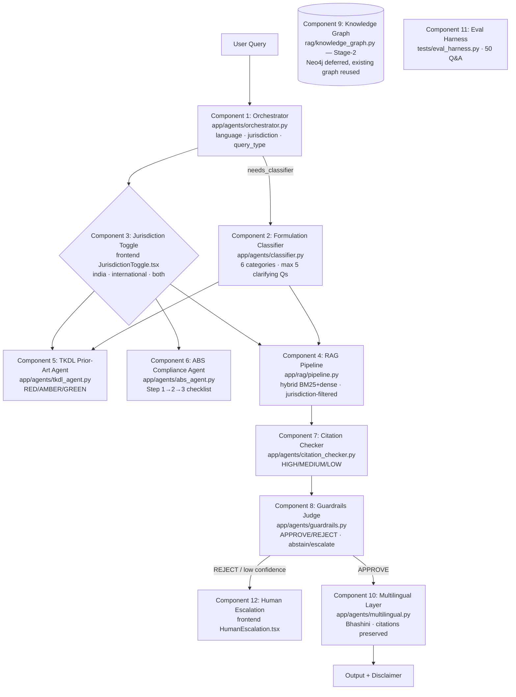

# IP-SAKTI Sahayak — Agentic RAG Architecture (Master Prompt v7.0.0)

Status: **Phases 1–6 complete** · 12 components implemented on top of the
existing codebase (nothing overwritten) · Date: 2026-09-26

---

## 1. Architecture Diagram



**Linking rules enforced by `app/agents/chain.py`:**
1. Orchestrator is the traffic police — every query starts there.
2. Classifier output flows into downstream agents via the shared context.
3. RAG retrieval is jurisdiction-filtered; `both` = two separate sections.
4. Citation verification runs after generation (hallucination defence).
5. Low confidence / guardrail REJECT → abstention + human escalation.

**Stage-2 note:** Neo4j was deliberately **not** introduced (no new infra
dependency); the existing `app/rag/knowledge_graph.py` provides entity
relations today. The swap point is isolated if Neo4j is later adopted.

---

## 2. Component → File Map

| # | Component | File | Prompt |
|---|---|---|---|
| 1 | Orchestrator | `backend/app/agents/orchestrator.py` | `prompts/orchestrator_prompt.txt` |
| 2 | Formulation Classifier | `backend/app/agents/classifier.py` | `prompts/classifier_prompt.txt` |
| 3 | Jurisdiction Toggle | `frontend/src/components/ui/JurisdictionToggle.tsx` | — |
| 4 | RAG Pipeline | `backend/app/rag/pipeline.py` | `prompts/rag_prompt.txt` |
| 5 | TKDL Prior-Art | `backend/app/agents/tkdl_agent.py` | `prompts/tkdl_prompt.txt` |
| 6 | ABS Compliance | `backend/app/agents/abs_agent.py` | `prompts/abs_prompt.txt` |
| 7 | Citation & Confidence | `backend/app/agents/citation_checker.py` | — |
| 8 | Guardrails / Abstention | `backend/app/agents/guardrails.py` | `prompts/guardrails_prompt.txt` |
| 9 | Knowledge Graph (Stage 2) | `backend/app/rag/knowledge_graph.py` (existing) | — |
| 10 | Multilingual Layer | `backend/app/agents/multilingual.py` | `prompts/multilingual_prompt.txt` |
| 11 | Eval Harness | `backend/tests/eval_harness.py` | — |
| 12 | Human Escalation | `frontend/src/components/escalation/HumanEscalation.tsx` | — |
| — | Chain / linking | `backend/app/agents/chain.py` | — |
| — | Agent base + context | `backend/app/agents/base.py` | — |
| — | HTTP endpoint | `backend/app/api/v1/agents_router.py` | — |

Built on existing infrastructure (not replaced): `HybridRetriever`
(BM25+dense+rerank), `llm_adapter` (Gemini/OpenAI/off),
`ABSComplianceEngine`, novelty-search TK corpus, `citation_validity_checker`,
`BhashiniClient`, `hallucination_guard`, `evidence_confidence_scorer`.

---

## 3. API Documentation

### `POST /api/v1/agents/agentic-chat`

Runs the complete 12-component chain for one query.

```json
// request
{
  "query": "Can we patent an Ashwagandha churna from Charaka Samhita?",
  "jurisdiction": "india",          // india | international | both (default india)
  "top_k": 5                        // 1..10 (default 5)
}
```

```json
// response (abridged)
{
  "answer": "...grounded answer + disclaimer or escalation message...",
  "status": "answered",             // answered | rejected | abstained
  "confidence": "HIGH",             // HIGH | MEDIUM | LOW
  "escalation_required": false,
  "routing": {"language": "en", "jurisdiction": "india",
               "query_type": "PRODUCT_SPECIFIC", "needs_classifier": true,
               "context": {"ingredients": ["ashwagandha"], ...}},
  "classification": {"category": "CLASSICAL_MEDICINE", "basis": "...",
                      "ip_posture_summary": "...", "abs_posture_summary": "..."},
  "prior_art": {"risk_level": "RED", "ingredient_findings": [...],
                 "matched_classical_texts": [...], "recommendations": [...]},
  "abs_path": null,                 // populated for ABS_QUESTION queries
  "citations": {"verified": true, "confidence": "HIGH", "unverified": []},
  "guardrails": {"verdict": "APPROVE", "suggested_action": "answer"},
  "translation": {"target_lang": "en", "translated": false},
  "jurisdiction": "india",
  "disclaimer": "This is general information, not legal advice."
}
```

Errors: `422` validation (query 3–2000 chars, jurisdiction pattern, top_k
range) · `500` pipeline failure (internal details never leaked).
Auth: optional bearer (same contract as `/chat/query`).

### `GET /api/v1/agents/components`

Lists the linked component slugs + count (health/introspection).

### Frontend components

```tsx
import { JurisdictionToggle } from '@/components/ui';
<JurisdictionToggle value={scope} onChange={setScope} />  // india|international|both

import { HumanEscalation } from '@/components/escalation/HumanEscalation';
<HumanEscalation query={lastQuery} log={trace} onExport={save} />
```

---

## 4. Deployment Guide

1. **Backend** — `cd backend && .\venv\Scripts\python.exe run.py`
   (FastAPI on `:8000`; PostgreSQL via `DATABASE_URL`, SQLite fallback).
2. **Frontend** — `cd frontend && npm run dev` (Next.js on `:3000`).
3. **Vector store** — Qdrant local mode (`app/rag/qdrant_local_data`) with
   BM25 fallback; a running server holds the local lock — for concurrent
   access use Qdrant Server and set the store env vars.
4. **LLM (optional)** — `IPSAKTI_LLM_PROVIDER=auto|gemini|openai|off` plus
   `GEMINI_API_KEY` / `OPENAI_API_KEY`. Provider `off` = fully deterministic
   offline behaviour (used by CI and the eval harness).
5. **Translation (optional)** — `IPSAKTI_BHASHINI_API_KEY` +
   `IPSAKTI_BHASHINI_USER_ID`; without them answers stay English with
   citations untouched (never machine-mangled statutes).
6. **Eval gate** — `cd backend && .\venv\Scripts\python.exe tests\eval_harness.py --strict`
   (exit 1 if routing < 0.9, abstention < 0.9, language < 0.9).
7. **Quality gates** — backend `pytest` + `ruff check .` + `mypy .`;
   frontend `npm test` + `npm run typecheck` + `npm run lint`.

---

## 5. User Manual (short)

1. **Ask** in English or Hindi (Latin or Devanagari) — the orchestrator
   detects the language and routes the question.
2. **Jurisdiction toggle** — pick *India*, *International* or *Both*.
   India answers never cite international instruments as binding; *Both*
   returns two separately-cited sections.
3. **Product questions** — the assistant may ask up to 5 clarifying
   questions (one at a time) before classifying your formulation into one of
   six categories (Classical, Proprietary, New Drug, Phytopharmaceutical,
   Ayurveda-Aahar, Cosmetic) and showing its IP + ABS posture.
4. **Prior-art screen** — RED/AMBER/GREEN with matched classical texts and
   recommendations. This is a *preliminary* screen, not a professional
   prior-art search.
5. **ABS path** — step-by-step authority/form/timeline checklist grounded in
   the Biological Diversity Act 2002 (amended 2023) + Rules 2024.
6. **Confidence badge** — HIGH / MEDIUM / LOW derived from verified
   citations. LOW → the assistant abstains and offers **Human IP
   Facilitator** escalation (email/call + export query log).
7. **Disclaimer** — every answer ends with: *This is general information,
   not legal advice.*

---

## 6. Test Evidence

| Gate | Result |
|---|---|
| Backend suite | 1949+ passed, 165 xfailed, 4 xpassed · coverage **86.3% ≥ 80%** |
| Frontend suite | 36 suites / 320 tests passed · `tsc` clean · lint 0 errors |
| Ruff / mypy | All checks passed · 0 errors in 243 files |
| Eval harness | **50/50 passed** — routing 1.0 · jurisdiction 1.0 · abstention 1.0 · category 1.0 · citation_rate 1.0 |
| New agentic tests | 126 tests (phase 2: 38, phase 3: 33, phase 4: 15 + registry/other) |

---

## 7. Security, Compliance & Retrieval Hardening (Groups G1-G6)

Delivered as six independently verifiable groups, each with its own test suite.

### G1 - Input defenses (PII redaction + prompt-injection sanitisation)

- `app/agents/input_defenses.py`: `redact_pii` (Aadhaar / phone / email / GSTIN
  -> typed placeholders), `sanitize_injection` (12 `INJECTION_PATTERNS` ->
  `[FILTERED]`), `defend_query`, `find_injections`, and the `InputDefenses`
  agent (LLM judge via `app/prompts/sanitizer_prompt.txt`, deterministic
  result is a sticky floor).
- Wired into `AgenticChain.execute` (step 0, result key `input_defense`),
  `POST /rag/ask` and the chat router; rule 9 in `app/prompts/rag_prompt.txt`
  covers context injection (R7).
- Tests: `tests/test_input_defenses.py` (18).

### G2 - Red-team suite

`tests/test_red_team_suite.py` (10 attacks, `security` marker): fabricated
sections, injected chunks, personal legal/medical advice, jurisdiction mixing,
dosage claims, Aadhaar leakage, role spoofing, system-prompt extraction,
malformed jurisdiction (422), oversized query (422).

### G3 - DPDP compliance + tamper-evident audit trail + RBAC

- `app/models/db_models.py`: `AuditLogEntry` (append-only, hash-chained).
- `app/services/audit_chain.py`: `record_event`, `verify_chain`, `chain_head`,
  `purge_expired_chat`, `actor_hash`; a global `before_flush` listener rejects
  any UPDATE/DELETE on audit rows.
- `app/auth/rbac.py`: `ROLES`, `normalize_role`, `require_role(*allowed)`,
  `log_permission`.
- `app/services/dpdp_service.py`: `CONSENT_NOTICE`, `notice_payload`,
  `retention_deadline`, `purge_expired` (`DPDP_RETENTION_DAYS`, default 90).
- `app/api/v1/dpdp_router.py`: `GET /dpdp/notice` (public),
  `GET /dpdp/audit-chain/verify` + `POST /dpdp/purge-retention` (admin only).
- `chat.query` and `agentic.query` are audited. Tests:
  `tests/test_dpdp_audit_rbac.py` (17).

### G4 - Law-Change Sentinel

`app/services/law_sentinel.py` + `LawSourceState` model: content-hash change
detection per watched source (env `IPSAKTI_SENTINEL_SOURCES`, default
`india_code, ip_india, nba, wipo`), `needs_reembed` flag, `law_sentinel.run`
audit event, injectable fetcher for tests. Endpoints: `GET /admin/law-sentinel`
(public status) and `POST /admin/law-sentinel/run`. Tests:
`tests/test_law_sentinel.py` (14).

### G5 - Dead-link checker + nightly eval regression gate

- `app/services/link_checker.py` + `scripts/check_links.py`: offline by
  default (`IPSAKTI_LINK_CHECK_LIVE=1` enables), checks every canonical +
  pointer URL of the corpus, reports `ok` / `dead` / `skipped`; CLI flags
  `--live --json --fail-on-dead`. Tests: `tests/test_link_checker.py` (8).
- `tests/test_eval_regression_gate.py`: opt-in (`IPSAKTI_EVAL_GATE=1`) 50-question
  eval gate asserting zero below-threshold metrics.

### G6 - Unified RAG: auto routing + fallback

- `app/services/rag/auto_selector.py`: deterministic rules - short entity
  lookup -> `graph`, multi-aspect question -> `agentic`, otherwise the
  configured default (`hybrid` when the default is `auto`).
- `POST /rag/search` accepts `rag_type=auto` (response `meta.auto_resolved` /
  `auto_reason`) and falls back to `hybrid` on engine failure
  (`meta.fallback_from` / `fallback_error`); `POST /rag/configure` accepts
  `auto` as the default.
- Frontend: `RagArchitecture` gained `'auto'`, the engine picker shows
  "RAG Auto", and the response summary reports the resolved engine.
- Tests: `tests/test_rag_auto_mode.py` (9).

### Measured gates after G1-G6

| Gate | Result |
|---|---|
| Backend suite | 2037 passed, 1 skipped, 165 xfailed, 3 xpassed - coverage **86.6%** |
| Frontend suite | 36 suites / 320 tests passed - `tsc` clean |
| Ruff / mypy | All checks passed - 0 errors in 260 files |

## 8. G8 - Filing Intelligence (A2 patent watch, A3 deadlines, C2 fees)

Recurring service layer: the platform now *watches* a formulation instead of
only answering questions about it once.

### 8.1 Patent watch (A2)

- `app/models/db_models.py`: `WatchProfile` (saved formulation: title,
  ingredients, indication, classical reference) and `WatchHit` (one prior-art
  match: patent no, overlap, advice, urgency, source URL).
- `app/services/watch_service.py`:
  - `score_overlap()` - deterministic ingredient-overlap floor. Token overlap
    against the patent text plus an indication bonus yields
    `match` / `partial` / `no_match`; stop-words and normalisation
    (`normalize_ingredient`) keep it reproducible.
  - `screen_patents()` - persists hits, deduplicated by patent number.
  - `run_watch_cycle()` - screens every active profile, stamps
    `last_checked_at`, and appends a `watch.cycle` audit-chain entry.
  - `build_digest()` - weekly digest grouped per profile, Hindi + English.
  - `enrich_with_llm()` - optional `AgentBase` comparator
    (`app/prompts/patent_watch_prompt.txt`) that may only add advice text; any
    patent number that is not in the supplied week list is dropped.
- `app/api/v1/watch_router.py`: `POST/GET /watch/profiles`,
  `DELETE /watch/profiles/{id}`, `POST /watch/run` (admin),
  `GET /watch/digest`.
- `app/services/ingestion_scheduler.py`: `_run_watch_cycle_guarded()` runs after
  a successful patent ingestion cycle, gated by `IPSAKTI_WATCH_SCHEDULER`
  (default on, inherits `IPSAKTI_INGESTION_SCHEDULER`) and never fatal.

### 8.2 Deadlines (A3)

- `TrackedDeadline` model plus `app/services/deadline_service.py`:
  `DEADLINE_RULES` encodes the statutory basis for each kind - patent renewals
  from the 3rd year, 12th-year window, trade mark and GI 10-year renewals, and
  an applicant-defined NBA/ABS milestone.
- `generate_deadlines()` derives every date from a user-entered anchor
  (leap-day safe); each row stores its reminder ladder and statutory basis.
- `upcoming()` returns due dates with the reminders that have already fired and
  the days left; `reminder_message()` is delivery-ready for the G10 adapter.
- API: `GET /deadlines/rules`, `POST /deadlines`, `POST /deadlines/schedule`,
  `GET /deadlines`, `POST /deadlines/{id}/done`.

### 8.3 Fee estimator (C2)

- `app/knowledge/fee_schedule.json` - official India fee reference (patent,
  trade mark, GI, NBA) with entity-class multipliers, per-route source URLs and
  an `as_of` date. Being a knowledge seed, the ingestion pipeline also indexes
  it, so the numbers are retrievable with citations.
- `app/services/fee_estimator.py`: `estimate()` returns line items, total,
  baseline total, concession saved and percentage, the official source URL and
  a "confirm on the official schedule" disclaimer. Startup 20%, small entity
  50%; unknown route or entity class raises instead of guessing.
- API: `GET /fees/routes`, `POST /fees/estimate`.

### 8.4 Gates

- `tests/test_watch_deadline_fees.py`: 52 tests (deterministic overlap floor,
  idempotent screening, audit entry, statutory deadline rules, leap day,
  concessions, API surface, scheduler hook).
- `tests/test_api_router_registry.py` updated for the new surface:
  30 routers, 103 paths, 107 operations, 86 unsecured; new secured operations
  listed explicitly.
- Ruff clean, mypy clean (265 files).
