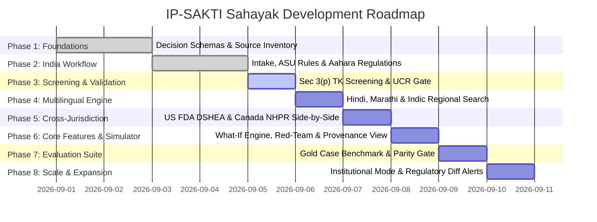

# IP-SAKTI Sahayak — Master Development Plan

> **Theme**: *"IP-SAKTI Sahayak — A multilingual, RAG-based (source-cited) AI assistant for Intellectual Property and regulatory guidance in Ayurveda, across national and international regimes."*

---

## 1. Roadmap Overview

The development roadmap is structured into 8 distinct phases as outlined in Section 14 and Section 18 of the Consolidated Specification.

---

## 2. Phase-by-Phase Deliverables & Milestones

### Phase 1: Foundations & Architecture
- **Objective**: Establish foundational schemas, legal source inventory, and application structure.
- **Key Deliverables**:
  - Pydantic models for `InnovationPassport`, `Fact`, `Rule`, `Finding`, `EvidenceLink`.
  - Ingestion of primary statutory gazettes (Drugs & Cosmetics Act 1940, FSSAI Ayurveda Aahara 2022, Patents Act 1970).
  - API Monograph database for top Ayurvedic botanicals (Ashwagandha, Brahmi, Curcumin, Tulsi, Guggulu, Neem, Shatavari).
  - Modular monolith folder layout for `backend/` and `frontend/`.

### Phase 2: India Text Workflow
- **Objective**: Complete end-to-end English workflow from intake to evidence-backed action plan for Indian regulatory pathways.
- **Key Deliverables**:
  - Deterministic evaluation for India ASU Drug (Classical vs Proprietary) vs Ayurveda Aahara (Food).
  - Ingredient legality check against FSSAI Ayurveda Aahara positive list.
  - Evidence-Gap action checklist with dependency-ordered tasks.

### Phase 3: IP & Traditional Knowledge Screening & Citation Gate
- **Objective**: Implement patentability screening under Indian Patents Act Section 3(p) and citation validation.
- **Key Deliverables**:
  - Formulation fingerprinting comparing canonical botanical ratios against prior art.
  - 4-Band Confidence & Abstention framework (`High`, `Medium`, `Low`, `Insufficient Evidence`).
  - Unsupported Claim Rate (UCR) gatekeeper ensuring every finding has a clickable statutory passage link.

### Phase 4: Multilingual Interaction & Regional Language Search
- **Objective**: Native Indic language intake, normalization, and explanation generation with strict meaning preservation.
- **Key Deliverables**:
  - Core validated workflows for English, Hindi (हिन्दी), Marathi (मराठी).
  - Multi-script botanical dictionary indexing vernacular plant names across Tamil, Telugu, Kannada, Bengali, Gujarati, Malayalam, Sanskrit.
  - Code-switching detection and botanical entity normalization.
  - Language-Parity release gate validation.

### Phase 5: Cross-Jurisdiction Comparison (India, US, Canada)
- **Objective**: Multi-country side-by-side comparative analysis without translating foreign rules into local terms.
- **Key Deliverables**:
  - US FDA DSHEA (21 CFR 101.93) classifier: Dietary Supplement vs Unapproved New Drug based on structure/function vs disease claims.
  - Health Canada Natural Health Products Regulations (NHPR) evaluator: Product License (NPN) vs Site License.
  - Per-ingredient legality checks against US FDA NDI list and Health Canada NHPID monograph list.
  - Side-by-side comparison matrix with explicit coverage limitations.

### Phase 6: Reactive What-If Simulator, Red-Team & Traceable Workspace
- **Objective**: Interactive decision-support tools empowering innovators before filing.
- **Key Deliverables**:
  - **What-If Simulator**: Live mutation DAG cloner showing instant diffs when modifying claims or ingredients.
  - **"Challenge My Innovation" Red-Team**: Examiner-style objections identifying Section 3(p) TK vulnerabilities and label claim risks.
  - **Traceable Decision Workspace ("Why?" View)**: Interactive graph linking Facts $\to$ Rules $\to$ Gazette Passages $\to$ Findings.
  - Voice intake simulation with transcript confirmation.

### Phase 7: Evaluation Suite & Benchmark Verification
- **Objective**: Quantitative validation of system accuracy, groundedness, and security.
- **Key Deliverables**:
  - Gold Standard case benchmark with 30+ validated multi-language cases.
  - Ablation comparison harness (LLM-only vs Basic RAG vs IP-SAKTI Full).
  - Prompt-injection red-team testing suite for document uploads.
  - Full execution of the 10-step SIH Demonstration Script (Section 18).

### Phase 8: Expansion & Institutional Multi-Tenancy
- **Objective**: Advanced ecosystem integrations for incubators and regulatory agencies.
- **Key Deliverables**:
  - Institutional Incubator Dashboard with multi-tenant case queues and cohort gap analytics.
  - Living Regulatory-Diff & Notification Service alerting users to statutory gazette amendments.
  - Expert Handoff bridge with DPDP Act-compliant consent and liability boundaries.
  - Offline-first draft intake with IndexedDB sync.
