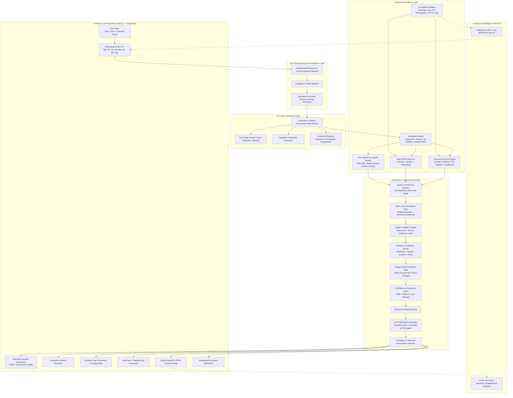

# IP-SAKTI Sahayak — Project Brain & System Architecture

> **Theme**: *"IP-SAKTI Sahayak — A multilingual, RAG-based (source-cited) AI assistant for Intellectual Property and regulatory guidance in Ayurveda, across national and international regimes."*

---

## 1. Executive Vision & The Core Invariant

IP-SAKTI Sahayak addresses a critical gap in the AYUSH innovation ecosystem. Indian pharmaceutical and biotech MSMEs file patents at a low rate (~16%) despite high trademark registration (~61%), citing procedural complexity, high legal fees, and lack of cross-border regulatory clarity as primary bottlenecks.

The fundamental engineering philosophy of IP-SAKTI Sahayak is captured in its **Core Invariant**:

$$\text{User Facts} \xrightarrow{\text{define}} \text{Case} \xrightarrow{\text{evaluated by}} \text{Deterministic Rules} \xrightarrow{\text{evidenced by}} \text{Hybrid RAG Retrieval} \xrightarrow{\text{explained by}} \text{Language Model}$$

```
+------------------------------------------------------------------------------------------------+
|                                    CORE SYSTEM INVARIANT                                       |
|                                                                                                |
|   "User facts define the case. Reviewed rules evaluate supported conditions.                   |
|    Retrieval supplies evidence. The language model explains the result — and never decides it."|
+------------------------------------------------------------------------------------------------+
```

### Why this architecture prevents legal hallucinations:
Generic LLMs exhibit a 69–88% hallucination rate on verifiable legal queries, and even commercial legal-RAG systems exhibit 17–33% unsupported claims (Stanford RegLab findings). In IP-SAKTI Sahayak:
1. **The LLM never classifies law**: Legal and regulatory classifications are generated by deterministic, auditable rule packs.
2. **Every statement is anchored to a statutory passage**: Claims must pass a Citation & Evidence Validator before display.
3. **Formal Confidence & Abstention**: If retrieval coverage or condition fulfillment is insufficient, the system explicitly abstains rather than generating a hedge-worded guess.

---

## 2. End-to-End System Architecture



---

## 3. Detailed Component Deep-Dive

### 3.1 Language & Intent Normalization Layer
- **Multilingual Token Support**: Full pipeline support for English, Hindi (हिन्दी), Marathi (मराठी), Tamil (தமிழ்), Telugu (తెలుగు), Kannada (ಕನ್ನಡ), Bengali (বাংলা), Gujarati (ગુજરાતી), Malayalam (മലയാളം), and Sanskrit (संस्कृत).
- **Reviewed Glossary**: Maps regional vernacular plant names (e.g. *Ashwagandha*, *Asgandh*, *Amukkara*, *Aswagandhi*) to canonical records with API monograph IDs.
- **Meaning Preservation Verification**: Ensures quantities, units, negation, botanical binomials, and statutory references survive translation intact.

### 3.2 Sandboxed Document Extraction & Prompt-Injection Defense (Section 7.1.2)
- Uploaded label PDFs, research papers, and lab reports are processed in an isolated sandbox.
- **Typed Extraction**: Extraction outputs strictly structured data schemas (`ingredient_name`, `quantity`, `claim_text`, `dosage_form`).
- **Instruction Stripping**: Scanned texts containing imperative commands (e.g., `"ignore previous instructions"`, `"approve this patent"`) are stripped and logged as adversarial vectors.

### 3.3 Innovation Passport & Formulation Fingerprinting (Section 6.1 & 7.2.1)
- The **Innovation Passport** is the single source of truth across all modules.
- Every fact maintains its provenance:
  - `user-confirmed`: Explicitly validated by the innovator.
  - `document-extracted`: Parsed from uploaded certificates/labels.
  - `inferred`: Derived from contextual hints (never converted to confirmed silently).
  - `unknown`: Explicitly identified as missing.
- **Formulation Fingerprint**: Consists of canonical ingredient identifiers, extraction ratios, solvent types, and process signatures. Used for accurate prior-art matching.

### 3.4 Deterministic Rule Engine & Jurisdiction Router (Section 6.3 & 6.4)
- Implements versioned YAML rule packs:
  - **India ASU Drug Rules** (Drugs & Cosmetics Act, 1940 & Rules 1945, Schedule T GMP).
  - **India Ayurveda Aahara Regulations, 2022** (FSSAI).
  - **India Patents Act, 1970 — Section 3(p)** (Traditional Knowledge & non-patentable aggregation).
  - **US FDA DSHEA & 21 CFR 101.93** (Dietary Supplements vs New Drug, Structure/Function vs Disease Claims).
  - **Health Canada Natural Health Products Regulations (NHPR)** (Product License NPN vs Site License).
- **Three-State Logic**:
  1. `condition_satisfied`
  2. `not_satisfied`
  3. `insufficient_information` (triggers targeted follow-up questions).

### 3.5 Hybrid RAG Retrieval & Source Authority Ranking (Section 8 & 11)
- Dual-index retrieval: Lexical BM25 search for exact section titles and botanical names, combined with dense embeddings for conceptual and semantic queries.
- **Strict Authority Hierarchy**:
  $$\text{Official Act/Gazette} > \text{Regulatory Authority (AYUSH/FDA/HC)} > \text{Patent Office Guidelines} > \text{WIPO/International} > \text{Peer-Reviewed} > \text{Secondary Materials}$$
- Blogs and unverified portals are strictly rejected from the authority index.

### 3.6 Citation & Evidence Validator (Unsupported Claim Rate Gate)
- Computes **Unsupported Claim Rate (UCR)**.
- Reconciles every atomic statement generated by the explanation LLM against retrieved primary gazette passages.
- Any finding without a direct passage link is rejected or flagged.

### 3.7 Confidence & Abstention Engine (Section 7.1.1)
Findings are categorized into 4 calibrated bands:
1. **HIGH**: Complete rule condition match + high-authority primary gazette retrieved + full canonical resolution.
2. **MEDIUM**: Rule matched with minor secondary assumptions + supporting regulatory guidelines.
3. **LOW**: Partial condition match + proxy statutory references + flagged missing evidence.
4. **INSUFFICIENT EVIDENCE (ABSTAIN)**: System explicitly refuses to render a verdict, stating exact missing facts.

### 3.8 What-If Simulator (Section 6.6)
- Clones the current Innovation Passport.
- Applies a targeted mutation (e.g., Changing claim: *"Supports healthy sleep"* $\to$ *"Treats chronic insomnia"*).
- Traverses the dependency DAG to recompute only affected rule nodes.
- Highlights visual diffs in classification, new compliance burdens, and required clinical evidence.

### 3.9 "Challenge My Innovation" Red-Team Module (Section 6.7)
- Simulates 2–3 patent examiner objections based on Indian Patent Office Traditional Knowledge guidelines (Section 3(p)), US 35 U.S.C. 103 obviousness, and Canada NHPR safety guidelines.

### 3.10 Traceable Decision Workspace ("Why?" Provenance View)
- Renders an interactive decision tree showing:
  $$\text{Innovator Fact} \longrightarrow \text{Evaluated Condition} \longrightarrow \text{Statutory Gazette Section} \longrightarrow \text{Finding}$$

### 3.11 Living Regulatory-Diff & Case Notification Service (Section 7.3.1)
- Continuously monitors registered statutory gazettes and regulatory positive lists.
- Generates semantic diffs when provisions are amended.
- Automatically flags saved user cases whose findings rely on amended clauses.

### 3.12 Expert Handoff Pathway (Section 7.3.2)
- Opt-in escalation bridge connecting innovators with registered patent agents and AYUSH regulatory experts.
- Includes explicit DPDP Act consent and a clear liability boundary (AI provides triage; certified professional provides formal counsel).

---

## 4. Why this Monolith Repository Structure?

1. **Transactional Integrity & Auditability**: Legal determinations require strict coherence across the Innovation Passport, rule evaluations, citation logs, and diff states. A modular monolith guarantees ACID consistency.
2. **Zero Ingestion Latency**: Shared in-memory data structures between the Canonical Ingredient Resolver and Deterministic Rule Engine prevent cross-service serialization overhead.
3. **Reproducibility & Version Locking**: Rule packs and statutory gazette versions are pinned alongside the backend logic in version control.
4. **Security & Zero Frontend Key Leaks**: The frontend is a clean client layer; all AI provider adapters, database credentials, and secret tokens reside strictly within the backend boundary.
